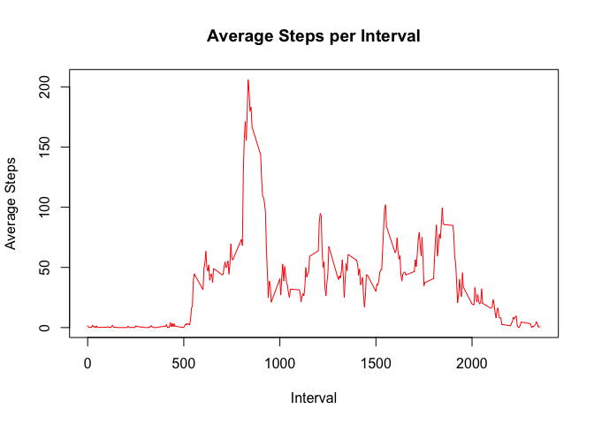
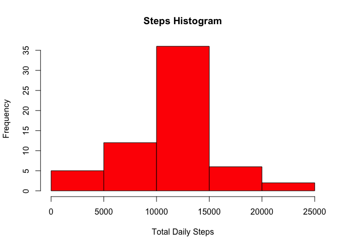
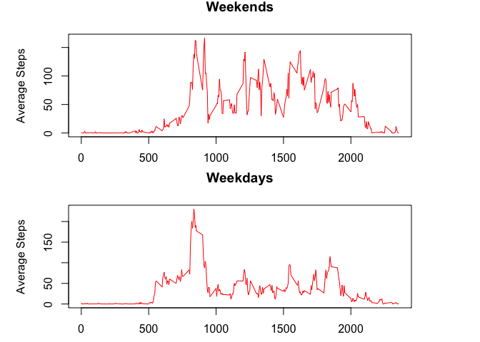

# Reproducible Research: Peer Assessment 1


## Loading and preprocessing the data
This code reads the data with 3 columns: steps: integer, date:character, and interval: integer

```r
dat <-read.table("activity.csv",sep=",",header=TRUE,stringsAsFactors=FALSE)
head(dat,1)
```

```
##   steps       date interval
## 1    NA 2012-10-01        0
```

## What is mean total number of steps taken per day?
We first add all the steps per day and then plot a histogram to understand how the data is distributed per day. Then the mean and median are calculated.

```r
stepsperday <-aggregate(dat$steps~dat$date,FUN=sum)
colnames(stepsperday)<-c("date","steps")
hist(stepsperday$steps,main="Steps Histogram",col="red",xlab="Total Daily Steps")
```

 


### The mean steps per day is:

```r
mean(stepsperday$steps)
```

```
## [1] 10766.19
```
###The median steps per day is:

```r
median(stepsperday$steps)
```

```
## [1] 10765
```
Mean and Median are very close numbers.  

## What is the average daily activity pattern?
We now calculate the average steps per interval and plot the data to show average daily activity patterns per interval.


```r
stepsperinterval <-aggregate(dat$steps~dat$interval,FUN=mean)
colnames(stepsperinterval)<-c("interval","steps")
plot(stepsperinterval$interval,type='l',stepsperinterval$steps,col="red",ylab="Average Steps",xlab="Interval",main="Average Steps per Interval")
```

 


###The Interval with a maximum # of steps is:

```r
stepsperinterval[max(stepsperinterval$steps)==stepsperinterval$steps,]
```

```
##     interval    steps
## 104      835 206.1698
```
## Imputing missing values
###The number of rows with missing values is

```r
nrow(dat[dat$steps=="NA",])
```

```
## [1] 2304
```
###Strategy to replace missing values 
We will now replace every occurrence of NA with the mean of steps per interval.  (If an observation has NA as the number of steps, we take the average of steps at that interval, and replace the NA with that value).

We will look at the histogram and mean and median for the new data with imputed values

```r
newdat<-merge(dat,stepsperinterval,by.x="interval",by.y="interval",all=FALSE)
newdat$steps.x<-ifelse(is.na(newdat$steps.x),newdat$steps.y,newdat$steps.x)
newstepsperday <-aggregate(newdat$steps.x~newdat$date,FUN=sum)
colnames(newstepsperday)<-c("date","steps")
hist(newstepsperday$steps,main="Steps Histogram",col="red",xlab="Total Daily Steps")
```

 


The histogram shows that there is now a higher number of observations close to the mean and median

### The mean steps per day is:

```r
mean(newstepsperday$steps)
```

```
## [1] 10766.19
```
###The median steps per day is:

```r
median(newstepsperday$steps)
```

```
## [1] 10766.19
```
There are not major differences in mean and median once the missing values are replaced by the mean per interval. The mean changes slightly as that was the value that was imputed for missing values.

## Are there differences in activity patterns between weekdays and weekends?

```r
newdat$dattype<-ifelse(weekdays(as.Date(newdat$date))=="Saturday"|weekdays(as.Date(newdat$date))=="Sunday","Weekend","Weekday")

datweekday<-newdat[newdat$dattype=="Weekday",]
datweekend<-newdat[newdat$dattype=="Weekend",]

weekdayperinterval <-aggregate(datweekday$steps.x~datweekday$interval,FUN=mean)
colnames(weekdayperinterval)<-c("interval","steps")

weekendperinterval <-aggregate(datweekend$steps.x~datweekend$interval,FUN=mean)
colnames(weekendperinterval)<-c("interval","steps")

par(mfrow=c(2,1),pin=c(5,1.5))
plot(weekendperinterval$interval,type='l',weekendperinterval$steps,col="red",ylab="Average Steps",xlab="Interval",main="Weekends")

plot(weekdayperinterval$interval,type='l',weekdayperinterval$steps,col="red",ylab="Average Steps",xlab="Interval",main="Weekdays")
```

 


There are differences between the patterns for weekdays vs. weekends. People seem to be more active during weekends.

